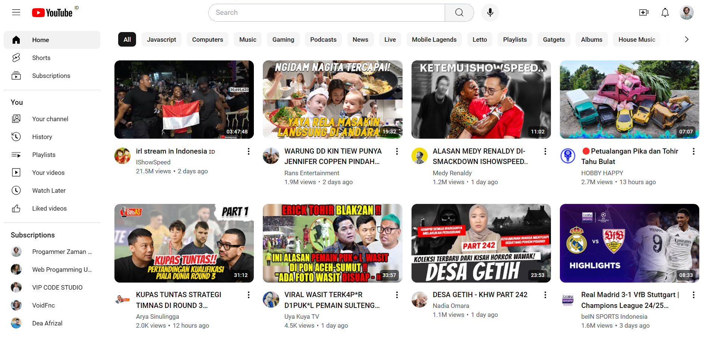
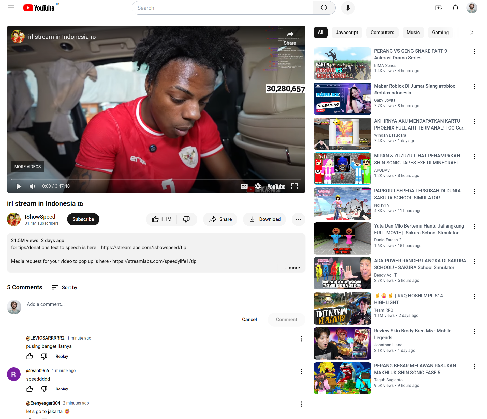
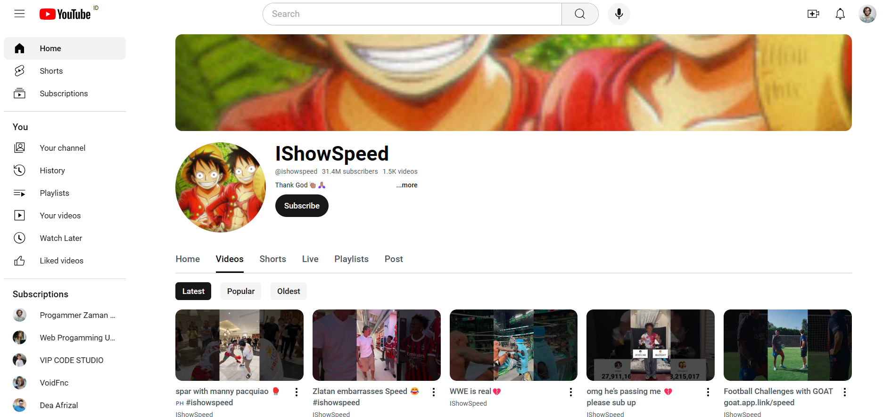

# Youtube CLone

This is a clone ui project inspired from [youtube.com](https://youtube.com)

<h2>Technical Stack</h2>

<h3>Frontend</h3>

<ul>
	<li><strong>Language:</strong> TypeScript</li>
	<li><strong>Framework:</strong> React.js</li>
	<li><strong>State:</strong> Zustand</li>
	<li><strong>Stayling:</strong> Tailwind</li>
</ul>

## Api

<a href="https://developers.google.com/youtube/v3" target="_blank">Youtube Data API v3 - Google CLoud Console</a>
